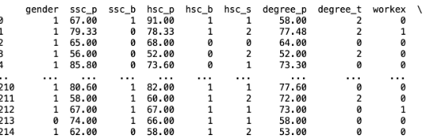
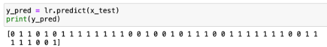
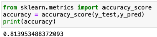
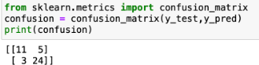
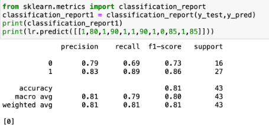

## Implementation of Logistic Regression Model to Predict the Placement Status of Student
### AIM:
To write a program to implement the the Logistic Regression Model to Predict the Placement Status of Student.
##$ Equipments Required:
1. Hardware – PCs
2. Anaconda – Python 3.7 Installation / Moodle-Code Runner
## Algorithm
1. Import pandas module and read the required csv file.
2. Import LabEncoder module.
3. From sklearn import logistic regression.
4. Predict the values of array.
5. Calculate the accuracy, confusion and classification report.
### Program:
```
Developed by: Sai Darshan G
RegisterNumber:  212221240047
import pandas as pd
data = pd.read_csv("Placement_Data.csv")
print(data.head())
data1 = data.copy()
data1= data1.drop(["sl_no","salary"],axis=1)
print(data1.head())
data1.isnull().sum()
data1.duplicated().sum()
from sklearn.preprocessing import LabelEncoder
lc = LabelEncoder()
data1["gender"] = lc.fit_transform(data1["gender"])
data1["ssc_b"] = lc.fit_transform(data1["ssc_b"])
data1["hsc_b"] = lc.fit_transform(data1["hsc_b"])
data1["hsc_s"] = lc.fit_transform(data1["hsc_s"])
data1["degree_t"]=lc.fit_transform(data["degree_t"])
data1["workex"] = lc.fit_transform(data1["workex"])
data1["specialisation"] = lc.fit_transform(data1["specialisation"])
data1["status"]=lc.fit_transform(data1["status"])
x = data1.iloc[:,:-1]
y = data1["status"]
from sklearn.model_selection import train_test_split
x_train, x_test, y_train, y_test = train_test_split(x,y,test_size=0.2,random_state=0)
from sklearn.linear_model import LogisticRegression
lr = LogisticRegression(solver="liblinear")
print(lr.fit(x_train,y_train))
y_pred = lr.predict(x_test)
from sklearn.metrics import accuracy_score
accuracy = accuracy_score(y_test,y_pred)
from sklearn.metrics import confusion_matrix
confusion = confusion_matrix(y_test,y_pred)
from sklearn.metrics import classification_report
classification_report1 = classification_report(y_test,y_pred)
print(lr.predict([[1,80,1,90,1,1,90,1,0,85,1,85]]))
```
### Output:





## Result:
Thus the program to implement the the Logistic Regression Model to Predict the Placement Status of Student is written and verified using python programming.
